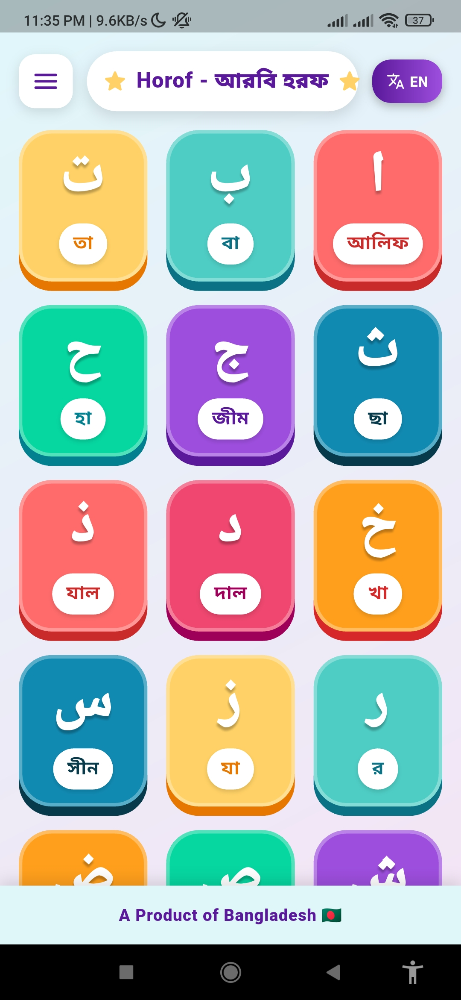

# Horof (হরফ) - Learn Arabic Alphabet

**Horof** is an interactive, child-friendly mobile application designed to help children learn the Arabic alphabet easily and enjoyably.

## 🌟 Features

- **Child-Friendly Interface**: Bright, colorful, and engaging design tailored for kids.
- **Interactive Learning**: Tap on any letter to hear its correct pronunciation.
- **Offline Audio**: All audio assets are stored locally, ensuring a smooth experience without needing an internet connection.
- **Complete Alphabet**: Includes all 28 Arabic letters, plus additional common forms like Laam-Alif and Hamza.
- **Right-to-Left Layout**: Natural reading flow for Arabic text.

## 📸 Screenshot



## 🚀 Getting Started

### Prerequisites

- Flutter SDK
- Android Studio / VS Code with Flutter extension
- An Android/iOS device or emulator

### Installation & Run

1. Navigate to the project directory:
   ```bash
   cd horof
   ```
2. Install dependencies:
   ```bash
   flutter pub get
   ```
3. Run the app:
   ```bash
   flutter run
   ```

## 🛠️ Tech Stack

- **Framework**: Flutter
- **Language**: Dart
